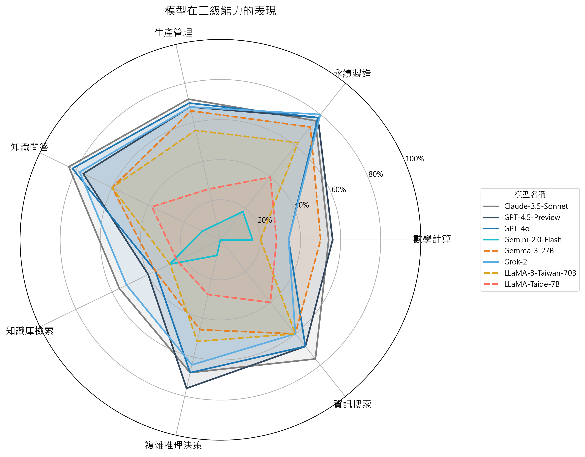

# SPAS-Bench: Smart Production Agents System Benchmark
SPAS-Bench 是一個針對智慧製造場域設計的大型語言模型基準資料集，涵蓋製造業需求的基礎能力、知識處理與決策、智慧應用三大類能力，並細分九個次級任務。其目標是促進語言模型在製造領域的真實應用能力評估。

## Introduction
本基準涵蓋三大能力面向：
- 製造基礎能力（數學計算、知識問答、文字理解與生成）
- 製造知識處理與決策（資訊搜索、知識庫檢索、複雜推理決策）
- 製造智慧應用（生產管理、能耗管理、永續管理）

SPAS 的測試資料包括：
- 選擇題、是非題、數值計算題
- 題庫以 `JSON` 格式儲存，包含題目 ID、分類、正確解答與提示資料
- 每個任務都明確對應工廠場景的實際需求

可以進一步查閱[`schema`](./question_schema.md)和 [`sample`](./sample_questions.json) 獲得欄位定義、格式和題目樣例。

## Evaluation Results
以下為幾項開源和閉源主要模型在不同能力層級的表現：

- 模型總體表現 vs 模型大小

- 模型在一級分類的表現

- 模型在二級能力的表現

- 完整的正確率資料：
[`score.csv`](./score.csv)

## 申請 SPAS-Bench 完整題庫

如若您對 SPAS-Bench 的興趣，由於本題庫部分內容涵蓋企業內部數據與知識，為避免資料外洩與抄襲風險，目前僅開放部分樣本題目供公開瀏覽與測試，完整題庫僅提供給符合條件之單位或研究用途使用。

1. 誰可以申請？
- 具備學術研究、語言模型評估、或製造業相關應用目的的團隊或個人
- 願意遵守使用規範並提供使用目的者

2. 如何申請？
請寄送以下信箱：
auodigitech.tw@gmail.com

或者聯繫作者：

- Stephannie Chen stephannie.chen@auodigitech.com

- Yuechen Wu yozhen.wu@auodigitech.com  

- Vera Liu vera.liu@auodigitech.com

申請內容請包含：
1. 您的姓名 / 單位 / 職稱
2. 使用目的（例如模型測試、學術研究、合作開發等）
3. 是否願意簽署簡易使用同意聲明

##  使用規範
申請並取得題庫者，請遵守以下規範：
- 不得對外轉發、重製或散布本題庫資料
- 不得作為任何商業用途**
- 公開使用或發表成果時，需註明資料來源為「SPAS-Bench, AUO Digitech人工智慧產品部」

如有違反使用規範，AUO Digitech 保留中止使用權與法律追訴權利。

若有任何疑問，歡迎與我們聯絡！

AUO Digitech人工智慧產品部

