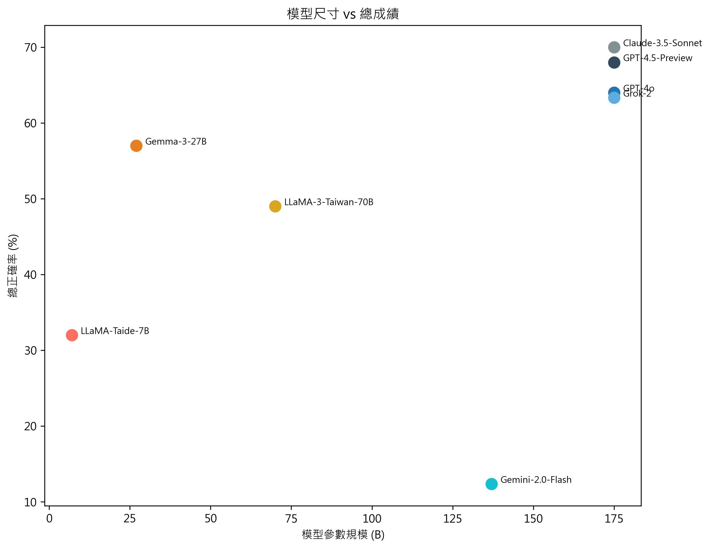

# SPAS-Bench: Smart Production Agents System Benchmark
SPAS-Bench 是一個針對智慧製造場域設計的大型語言模型基準資料集，涵蓋製造業需求的基礎能力、知識處理與決策、智慧應用三大類能力，並細分九個次級任務。其目標是促進語言模型在製造領域的真實應用能力評估。

## Introduction
本基準涵蓋三大能力面向：
- 製造基礎能力（數學計算、知識問答、文字理解與生成）
- 製造知識處理與決策（資訊搜索、知識庫檢索、複雜推理決策）
- 製造智慧應用（生產管理、能耗管理、永續管理）

SPAS 的測試資料包括：
- 選擇題、是非題、數值計算題
- 題庫以 `JSON` 格式儲存，包含題目 ID、分類、正確解答與提示資料
- 每個任務都明確對應工廠場景的實際需求

可以進一步查閱[`schema`](./question_schema.md)和 [`sample`](./sample_questions.json) 獲得欄位定義、格式和題目樣例。

## Evaluation Results
以下為幾項開源和閉源主要模型在不同能力層級的表現：

- 模型總體表現 vs 模型大小
  
  下圖展示多個語言模型在總正確率與模型參數規模之間的關係。橫軸為模型參數規模（Billion，B），縱軸為總正確率（%）。模型依開源與否以色系區分：暖色系代表開源模型，冷色系代表閉源模型。整體而言，閉源模型表現明顯優越，大多集中於總正確率 60% 以上的區間，包括：GPT-4.5-Preview、GPT-4o、Claude-3.5-Sonnet、Grok-2。相較之下，開源模型表現差異較大：Gemma-3-27B 在開源模型中表現最為優異，總正確率約為 57%，與部分閉源模型接近。LLaMA-3-Taiwan-70B 縱然規模較大，但正確率未超過 50%，顯示效能未隨模型尺寸成正比提升。

- 模型在一級分類的表現
  
  下圖呈現八個語言模型在三個一級類別任務上的表現，分別為：「製造基礎能力」、「製造知識處理與決策」與「製造智慧應用」。閉源模型整體表現穩定，尤其在「製造智慧應用」中具備顯著優勢。其中：Claude-3.5-Sonnet 在三類任務中皆維持高水準表現，最高達 74%；GPT-4o 在「智慧應用」的表現與 Claude 並列最高，達 74%，而在其他兩類也保持 58–60%；Grok-2 雖然在前兩項能力中略遜（56%、60%），但在「智慧應用」達到 74%，顯示其強化推理與應用能力；GPT-4.5-Preview 三項正確率穩定在 65–73% 之間，展現高度一致性。開源模型中，僅有 Gemma-3-27B 在「智慧應用」類別表現接近閉源模型，達 69%，但其在其他兩類（47%、55%）略顯不足，顯示該模型偏重應用層任務。

- 模型在二級能力的表現
  
  下圖呈現八個語言模型在七項二級能力指標上的表現，包括：「數學計算」、「資訊搜尋」、「複雜推理決策」、「知識庫檢索」、「知識問答」、「生產管理」與「永續製造」。此雷達圖有助於直觀比較各模型的技能分布特性，並觀察模型在特定任務類型上的優劣差異。整體而言，閉源模型Claude-3.5-Sonnet、GPT-4.5-Preview 與 GPT-4o 在各項能力上皆呈現均衡且高水準表現，其中：GPT-4.5-Preview 在「複雜推理決策」、「知識問答」與「永續製造」等應用導向任務中具優勢，展現出良好的綜合理解與推理能力；GPT-4o 在「資訊搜尋」與「數學計算」具備穩定表現，補足語言模型常見的弱項；Claude-3.5-Sonnet 於「知識庫檢索」與「知識問答」項目表現最突出，可能受益於其訓練資料中知識結構與檢索能力的強化。開源模型中，Gemma-3-27B 展現領先優勢，特別在「知識問答」與「永續製造」能力上逼近閉源模型，但在「複雜推理決策」與「資訊搜尋」項目略顯不足。

- 完整的正確率資料
  
  總體而言，閉源模型在三大一級任務展現出色且穩定的能力，特別是在需要綜合推理與應用的「製造智慧應用」領域表現最佳。在開源模型中，Gemma-3-27B 於「智慧應用」具競爭力，可能源於其較完整的多任務訓練機制。高模型規模並不必然帶來全面性表現優勢，亦需結合任務導向之優化策略。更多詳細資料請見：
[`score.csv`](./score.csv)

## 申請 SPAS-Bench 完整題庫

如若您對 SPAS-Bench 的興趣，由於本題庫部分內容涵蓋企業內部數據與知識，為避免資料外洩與抄襲風險，目前僅開放部分樣本題目供公開瀏覽與測試，完整題庫僅提供給符合條件之單位或研究用途使用。

1. 誰可以申請？
- 具備學術研究、語言模型評估、或製造業相關應用目的的團隊或個人
- 願意遵守使用規範並提供使用目的者

2. 如何申請？
請寄送以下信箱：
auodigitech.tw@gmail.com

或者聯繫作者：

- Stephannie Chen stephannie.chen@auodigitech.com

- Youzhen Wu yozhen.wu@auodigitech.com  

- Vera Liu vera.liu@auodigitech.com

申請內容請包含：
1. 您的姓名 / 單位 / 職稱
2. 使用目的（例如模型測試、學術研究、合作開發等）
3. 是否願意簽署簡易使用同意聲明

##  使用規範
申請並取得題庫者，請遵守以下規範：
- 不得對外轉發、重製或散布本題庫資料
- 不得作為任何商業用途**
- 公開使用或發表成果時，需註明資料來源為「SPAS-Bench, AUO Digitech人工智慧產品部」

如有違反使用規範，AUO Digitech 保留中止使用權與法律追訴權利。

若有任何疑問，歡迎與我們聯絡！

AUO Digitech人工智慧產品部

